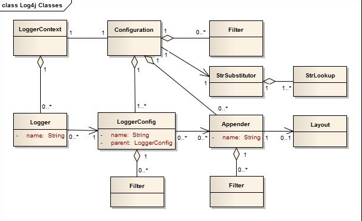

# Log4j2 Architecture

# Log4j2 Configuration
1. XML,JSON, YAML or properties file.
2. Configuration factoryand configuraiton implementation.
3. APIs exposed in the configuration interface
4. Calling methos on the internal logger class.